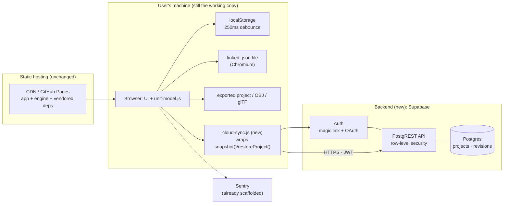

# Iso Home — Systems Architecture for 1,000 Users

*Target: 1,000 users with **accounts and cloud-saved projects** — sign in on any machine, and your apartments follow you. This extends [SYSTEM-DESIGN.md](SYSTEM-DESIGN.md), which took the app to a hosted, single-user, no-backend tool. That document's "no backend" decision (§3, "Key decision") was correct for its target; this one changes the target, so it changes the decision — as narrowly as possible.*

---

## 1. Size the problem first

Before designing anything, it's worth knowing what 1,000 users actually weighs. A saved project (`iso-home.json`, the `iso-home-project` v1 format) is **~3 KB** for two furnished apartments; call it **≤20 KB** with headroom for more plans and dense layouts.

| Quantity | Estimate | Why it's small |
|---|---|---|
| Live project data | 1,000 users × ~3 projects × 20 KB ≈ **60 MB** | Fits in RAM on the smallest database anyone sells |
| Peak write rate | ~50 concurrent editors ÷ 5 s push debounce ≈ **10 writes/s** | A single small Postgres handles thousands |
| Peak read rate | Sign-ins + project opens; **well under 10 reads/s** | Same |
| Monthly egress | Generously, **single-digit GB** | The app itself still ships from a CDN, not the backend |

**The conclusion drives the whole design: at 1,000 users, scale is not the problem.** Nothing here needs sharding, queues, caching layers, or autoscaling. The real problem is architectural: the app's persistence model is *origin-bound and machine-local* (localStorage → linked file → exported file), and accounts demand a fourth tier that is *identity-bound and server-side* — added without breaking the offline-first behaviour that makes the current app resilient. Optimize for operational simplicity and data safety, not throughput.

---

## 2. Target architecture



Three properties to hold onto:

1. **The frontend stays static.** The app still loads entirely from the CDN with zero backend requests. The backend is a *separate origin* the page talks to only after sign-in. A backend outage degrades the app to exactly what it is today — fully functional, locally persisted — never to a blank page.
2. **The engine stays untouched.** `unit-model.js` already exposes the complete boundary a sync layer needs: `snapshot()` returns the whole project as one document, `restoreProject(doc)` applies one (validating format and filtering unknown catalog keys), `onChange` fires on every edit, and the `pagehide` flush pattern exists. Cloud sync is a new consumer of that boundary — a sibling of the linked-file feature, not an engine change. This is the same principle as SYSTEM-DESIGN.md §4.
3. **Cloud is a fourth persistence tier, not a replacement.** localStorage remains the instant working copy, the linked file remains the Chromium autosave, the exported file remains the copy that always survives. The cloud copy is the one that follows the *account*.

---

## 3. Backend choice

The requirement is: auth, one table of small JSON documents, per-user access control, and as little code to own as possible. That's a backend-as-a-service shape, not a build-it shape.

| Option | What you own | Fit |
|---|---|---|
| **Supabase** (Postgres + Auth + PostgREST + RLS) | Schema + row-level-security policies; near-zero API code | **Recommended.** Real Postgres (portable, inspectable), auth built in, access control lives in the database as RLS policies — the API layer is generated |
| Cloudflare Workers + D1 + auth library | All API routes, sessions, token handling | More code and more security surface to own for no benefit at this scale |
| Firebase / Firestore | Security-rules DSL, NoSQL modeling | Works, but proprietary data model and rules language; harder to walk away from |

**Why RLS matters here:** access control enforced *in the database* ("a row is visible only when `owner_id = auth.uid()`") means there is no custom API code whose bugs could leak one user's apartments to another. The class of vulnerability is removed rather than guarded against — the same instinct as the engine's catalog-key allowlist on file load.

**Cost** (secondary, but for the record): the Pro tier is $25/mo as of this writing and is the right choice — free-tier projects auto-pause after ~a week of inactivity, which is unacceptable once real users have accounts, and Pro adds daily backups. Free-tier capacity (500 MB database, 50k monthly active users) would otherwise fit 1,000 users several times over; verify current terms at supabase.com/pricing.

---

## 4. Data model

```sql
-- profiles: one row per auth user (created by trigger on sign-up)
create table profiles (
  id         uuid primary key references auth.users on delete cascade,
  created_at timestamptz not null default now()
);

-- projects: the live documents. doc is the iso-home-project JSON, verbatim.
create table projects (
  id          uuid primary key default gen_random_uuid(),
  owner_id    uuid not null references profiles(id) on delete cascade,
  name        text not null default 'My apartments',
  doc         jsonb not null,          -- {format, version, saved, activePlan, plans}
  doc_version int  not null default 1, -- mirrors doc.version for cheap querying
  rev         bigint not null default 1, -- server-side revision, +1 per write
  updated_at  timestamptz not null default now(),
  deleted_at  timestamptz              -- soft delete; hard-purge after 30 days
);

-- project_revisions: history. Insurance against sync bugs and bad merges.
create table project_revisions (
  project_id uuid not null references projects(id) on delete cascade,
  rev        bigint not null,
  doc        jsonb not null,
  saved_at   timestamptz not null default now(),
  primary key (project_id, rev)
);

-- RLS: every policy is one line of intent
alter table projects enable row level security;
create policy "own rows" on projects
  for all using (owner_id = auth.uid());
-- (same shape on profiles and project_revisions)
```

Decisions worth explaining:

- **The document stays opaque JSON.** The server never interprets `plans`, `C`, or `items` — it stores what `snapshot()` produced and returns it to `restoreProject()`. All format knowledge (version migrations, plan `rev` invalidation, catalog filtering) stays in the client where it already lives. The server adds only identity and durability. A server that understood the format would have to be updated in lockstep with the engine — a coupling with no payoff.
- **`rev` is assigned by the server, not the client, and not a timestamp.** Client clocks are wrong often enough that "last write wins by wall clock" corrupts data in exactly the cross-device case accounts exist to serve. A monotonic server counter gives an unambiguous ordering and a compare-and-swap handle (§5).
- **Revisions make every conflict recoverable.** At ≤20 KB per document, keeping the last 50 revisions per project costs ~1 MB per project (a few MB per user) *worst case* — trivially cheap insurance. A trigger copies the old doc into `project_revisions` on every update; a scheduled job prunes beyond 50. This is what turns "last write wins" from data loss into an undo.
- **Server-side guards:** reject docs over 1 MB, reject `format ≠ 'iso-home-project'`, cap projects per user (say 100) — via `check` constraints and a small `before insert/update` trigger. Abuse limits, not capacity limits.

---

## 5. The sync protocol

This is the heart of the design. The model to copy is the one the codebase already proved with the linked file: *a write-through target fed by the debounced snapshot, with an explicit rule for who wins on resume.*

**Push (local → cloud).** On the engine's `onChange`, debounce **5 s** (localStorage debounces 250 ms because disk is free; the linked file waits ~1.2 s; the network deserves more patience) → `snapshot()` → skip if the hash matches the last push → write with compare-and-swap:

```
UPDATE projects SET doc = $doc, rev = rev + 1, updated_at = now()
WHERE id = $id AND rev = $lastSeenRev
```

Zero rows updated means someone else (another device, another tab) wrote first — that's the conflict path below, detected structurally rather than by guessing from timestamps. On `pagehide`, flush with `fetch(..., {keepalive: true})` — the network sibling of the existing `pagehide` → `flushSave()` pattern (`sendBeacon` can't carry the auth header; keepalive fetch can).

**Pull (cloud → local).** On app open while signed in, fetch the project and compare server `rev` against the locally remembered `lastSyncedRev`:

| Server since last sync | Local since last sync | Action |
|---|---|---|
| unchanged | unchanged | nothing |
| ahead | unchanged | server wins → `restoreProject(serverDoc)` — the generalization of the linked-file "the file wins on resume" rule, for the same reason: it's the copy that survives this machine's cache being cleared |
| unchanged | changed | push local |
| ahead | changed | **conflict**: last write wins by server `rev`; the losing document is stashed as a revision; UI shows "Updated from another device — restore this device's version?" |

**Why not real-time merging (CRDTs/OT):** each account has one human. Conflicts happen only when that human edits from two devices in the same debounce window — rare, low-stakes, and fully recoverable via revisions. CRDT machinery would be the most complex component in the entire system, permanently, to improve a case a "restore previous version" button already handles. If simultaneous multi-user editing ever becomes a goal, that's a different product and a different document.

```mermaid
sequenceDiagram
    participant E as unit-model.js
    participant S as cloud-sync.js
    participant A as Supabase
    E->>S: onChange
    Note over S: debounce 5s, hash-skip
    S->>E: snapshot()
    S->>A: UPDATE … WHERE rev = lastSeenRev
    alt CAS succeeds
        A-->>S: new rev
        Note over S: status "Saved to cloud"
    else 0 rows (other device won)
        S->>A: fetch server doc + rev
        Note over S: LWW; stash loser as revision
        S->>E: restoreProject(serverDoc)
        Note over S: offer "restore this device's version"
    end
```

---

## 6. Auth, and the path from anonymous to account

- **Methods: magic-link email + OAuth (GitHub, Google).** No passwords — nothing to store, hash, rate-limit, or get breached. Supabase Auth handles token issuance and refresh (PKCE flow).
- **Signed-out is not a degraded mode; it's today's app, unchanged.** No sign-in wall, ever. The tool stays fully usable anonymously with the existing three tiers.
- **First sign-in adopts the local work.** If localStorage holds a project, offer: *"Save your current apartments to your account?"* → `snapshot()` → create the row. The reverse rule on a fresh machine: cloud is fetched and restored (empty local, server ahead — the table in §5 already covers it).
- **Account UI is small on purpose:** a sign-in button, a sync-status word ("Saved to cloud · Offline — will sync · Updated from another device"), and a project list. The status line matters most — the current app earns trust by showing where data lives (`project()`, `storageOK()`); the cloud tier must meet that bar, silence being how sync features lose people's work reputationally even when they didn't.

---

## 7. What changes in the client

One new file, `cloud-sync.js`, alongside the `vendor/error-reporting.js` pattern: reads the engine's public API only (`snapshot`, `restoreProject`, `onChange`), owns the debounce/hash/CAS loop and auth session, and exposes status for the UI. The Supabase JS client is **vendored** like everything else — the zero-third-party-request property of the static app is kept; the only runtime network dependency is the API itself, which is the product.

Supporting changes: CSP gains one directive (`connect-src https://<project-ref>.supabase.co`) and stays otherwise strict; the UI gains the §6 elements; **the canonical-domain rule from SYSTEM-DESIGN.md §3.3 hardens further** — the origin is now also the OAuth redirect target, so pick the domain before the first account exists.

---

## 8. The obligations that arrive with accounts

Accounts are less a feature than a set of promises. The no-backend design avoided these deliberately; accepting them should be equally deliberate.

- **Privacy.** An email address is now held: a short plain-language privacy note (what's stored — email plus project geometry; no analytics on layout content), and a working **delete my account** that cascades (the schema's `on delete cascade` chain does this) plus purges soft-deleted rows on schedule. Data export already exists — it's the project file download.
- **Backups.** Pro-tier daily backups, plus a weekly `pg_dump` to separate storage — restore-tested once, because an untested backup is a hypothesis.
- **Availability.** The SLO is modest and honest: the *app* never goes down with the backend (offline-first guarantees it); sync recovers on reconnect. An uptime check on the API and the page (a scheduled GitHub Action suffices) so the first report of an outage isn't a user email — the same reasoning that motivated Sentry.
- **Abuse.** The §4 guards (doc size, project count, format check) plus Supabase's built-in auth rate limits. At this scale that's sufficient.
- **Secrets discipline.** The client ships only the *publishable* anon key (safe by design — RLS is the security boundary). The `service_role` key exists nowhere but CI secrets and the dashboard. This extends the existing per-session PAT discipline.

---

## 9. Testing & CI additions

The existing gates (Node smoke test, export validation) stay. Two new ones, both runnable against `supabase start` (local Postgres in CI — no cloud project needed):

1. **RLS tests — the ones that actually matter.** Sign in as user A and user B; assert B cannot select, update, or delete A's rows. A failure here is the worst bug this system can have, and it's cheap to test for on every push.
2. **Round-trip through the API.** `snapshot()` → push → pull → `restoreProject()` → deep-equal — the cloud-tier extension of the round-trip test SYSTEM-DESIGN.md §3.4 already planned, protecting the format across the network boundary. Plus a CAS test: two writers race; exactly one succeeds; the loser lands in `project_revisions`.

---

## 10. Rollout

**Phase A — Foundations.** Supabase project (region near users) · schema + RLS + revision trigger from §4 · auth providers configured against the canonical domain · RLS tests in CI · vendored client + CSP change, behind a flag with no UI.

**Phase B — Sync.** `cloud-sync.js` push/pull/CAS loop · sign-in UI + status line · keepalive flush · adopt-local-project on first sign-in · Sentry DSN activated (already pending) with sync errors tagged.

**Phase C — Promises.** Restore-previous-version UI over `project_revisions` · account deletion + privacy note · backup restore drill · uptime checks · multiple named projects.

**Phase D — Only if wanted.** Share links — now nearly free (a `shares` table mapping token → read-only doc; the earlier URL-fragment idea remains valid for the anonymous case) · team/multi-user editing — explicitly out of scope (§5).

---

## 11. What deliberately stays the same

Everything SYSTEM-DESIGN.md §4 listed, plus: the static frontend and its CDN hosting, the three local persistence tiers and their debounce/flush behaviour, the linked-file feature (it becomes redundant *for signed-in Chromium users* but remains the best offline autosave for anonymous ones), the export paths, and the engine's public API — which this design consumes and does not modify.

## 12. Open questions

The canonical domain, now urgent for OAuth (§7). Supabase region. Whether the linked-file UI should be de-emphasized once cloud sync exists, or kept co-equal. And whether "multiple named projects" is Phase C or premature — the current single-project model may be right for longer than expected.
