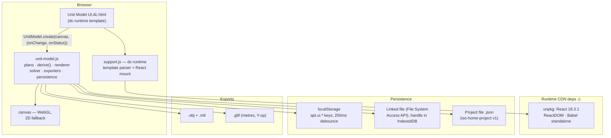
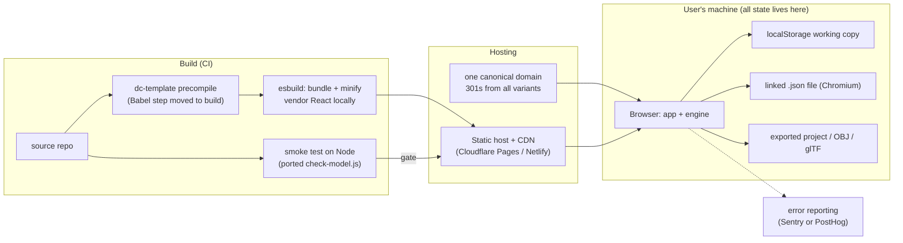

# Iso Home — Systems Design for Production

*Target: a hosted, single-user web tool. Anyone can open the URL and model an apartment; their work persists locally (browser storage + project files), with no accounts and no server-side state.*

---

## 1. What exists today

The project is already well-factored for this target. The heavy lifting is done in a dependency-free engine; the production work is almost entirely packaging, hosting, and hardening — not rearchitecting.

| File | Role | Notes |
|---|---|---|
| `unit-model.js` (~3.2k lines) | The engine: plan registry, parametric `derive()`, WebGL renderer with 2D-canvas fallback, furniture catalog + clearance/constraint solver, undo, OBJ/MTL/glTF exporters, all persistence | Zero dependencies. IIFE exposing `window.UnitModel.create(canvas, opts)` |
| `Unit Model UI.dc.html` | The interface: toolbar, catalog, Fit/Export/Project tabs, file pickers | Written against the `dc-runtime` template format (`<x-dc>`) |
| `Floor Plan.dc.html` | Static 2D presentation sheet of the A-101 plan | Same runtime; loads Google Fonts |
| `support.js` | `dc-runtime` — parses `<x-dc>` templates, mounts a React root | **Generated file** (from `dc-runtime/src/*.ts`, built with bun); pulls React 18.3.1, ReactDOM, and Babel standalone from unpkg at runtime |
| `check-model.js` / `.sh` | Headless smoke test: runs every plan, prints areas, room schedule, route widths | Runs on JavaScriptCore — macOS only |
| `iso-home.json` | Sample saved project (`iso-home-project` v1) | The interchange format |
| `uploads/apartment-3d.html` | The original monolith the engine was extracted from | Reference only; not shipped |

### Current architecture

The persistence design is deliberately tiered and worth preserving as-is: localStorage is the instant working copy (fragile, origin-bound), the FSA-linked file is the durable autosave for Chromium users, and the exported project file is the copy that always survives. The engine already flushes on `pagehide`/`visibilitychange` and guards against a loaded file injecting catalog keys the build doesn't have.

---

## 2. Gaps between here and production

**Runtime CDN dependency (highest risk).** `support.js` loads React, ReactDOM, and Babel standalone from unpkg at page load. If unpkg is slow or down, the app doesn't start. Babel-in-the-browser also means the UI template is compiled on every visit — hundreds of ms of startup cost on every load, and it rules out a strict Content-Security-Policy.

**No build pipeline.** The site is raw files with spaces in filenames (`Unit Model UI.dc.html`), no minification, no cache-busting hashes, no way to run the dc-template compilation ahead of time.

**Origin-bound storage surprises.** localStorage is bound to the origin. The code already documents this ("open the same model from a different address and it starts empty"), but production makes it real: any domain change, or a user switching between `www` and apex, silently presents an empty app. This must be locked down before launch — one canonical domain, permanent redirects from every variant.

**Linked-file autosave is Chromium-only.** `showOpenFilePicker` / FSA doesn't exist in Firefox or Safari. The engine already degrades (the `FSA` flag gates the feature and manual save/load always works), but the UI copy should say so explicitly rather than hiding the button's absence.

**Save-format versioning is thin.** The project format carries `version: 1` and configs are keyed by plan `rev`, which correctly invalidates stale configs — but there is no migration path, only discard. Fine now; needs a policy before the format ever changes shape.

**Tests can't run in CI.** `check-model.sh` requires macOS's JavaScriptCore. The smoke test itself is excellent — it executes the identical script the page runs and fails on any ReferenceError — it just needs a portable runner.

**No observability.** A production tool with no error reporting means the first sign of a broken deploy is a user email. Silent failures in a canvas app are especially invisible.

**Minor:** Google Fonts on the Floor Plan sheet is another third-party runtime dependency; no favicon/meta/social cards; no explicit browser-support statement; `uploads/` (screenshots, the old monolith) would ship to the CDN if the whole folder is deployed.

---

## 3. Target architecture

**Key decision: no backend.** The single-user target means the server is a CDN and nothing else. All state stays on the user's machine, in the three tiers that already exist. This keeps hosting near-free, removes auth/privacy/GDPR surface almost entirely, and matches how the code was designed. The one thing a backend would buy — shareable links — is listed as a future option in §6.

### 3.1 Kill the runtime CDN + Babel

Move template compilation to build time. Two ways, in order of preference:

1. **Precompile the `<x-dc>` templates in CI.** The dc-runtime source exists (`dc-runtime/src/*.ts`); add a build entry point that runs the same parse/transform Babel does in the browser, and emit plain JS. The page then ships compiled components, React vendored locally, no Babel at all.
2. **Port the UI shell to plain React (or Preact) built with Vite/esbuild.** More work (~950 lines of template), but ends the dc-runtime dependency entirely. Worth it if dc-runtime isn't something you want to maintain. Preact would cut the vendor payload to ~4 KB, and nothing in the UI uses React-specific APIs beyond refs and createElement.

Either way the production page loads exactly three first-party scripts (runtime, UI, engine), all hashed, all from your own origin, enabling a strict CSP (`script-src 'self'`). Self-host the two Floor Plan fonts too.

### 3.2 Build & deploy pipeline

esbuild (or Vite) for bundling — the codebase is small and dependency-free, so build time is trivial. Output goes to `dist/` with content-hashed filenames and immutable cache headers; `index.html` gets a short TTL. Rename shipped files to URL-safe names (`unit-model-ui.html`). Exclude `uploads/` and dev artifacts. Deploy on push to `main` via Cloudflare Pages or Netlify — both give preview URLs per branch, which is how UI changes get reviewed. **The smoke test gates the deploy** (see 3.4).

### 3.3 Persistence & format policy

Keep the three tiers unchanged. Add three rules:

1. **Format version bumps require a migration.** Any change to `iso-home-project` bumps `version` and ships an upgrader in `restoreProject` (v1 → v2 → …). Loading a *newer* version than the build knows shows a clear "this file was saved by a newer version" message instead of failing quietly.
2. **Plan `rev` bumps keep discarding stale configs** — that behavior is correct and already documented in the code; just note it in release notes when it happens, since a user's tweaked dimensions vanish by design.
3. **One canonical origin, forever.** Domain choice is a data-durability decision here, not a branding one. Redirect all variants with 301s from day one.

Optionally add a service worker (Workbox, cache-first for hashed assets) so the app opens offline — a natural fit since all data is local anyway. This is polish, not launch-blocking.

### 3.4 Testing & CI

Port `check-model.js` to run on Node (its DOM-stubbing Proxy approach carries over almost unchanged; the jsc-specific bits are minimal). CI then runs on any runner: execute the engine headless for every plan, assert areas / room schedules / route widths against golden values, and fail the deploy on any error. Add two more checks over time: a JSON round-trip test (save → load → deep-equal snapshot) to protect the project format, and export validation (run `buildGLTF()` output through a glTF validator).

### 3.5 Observability

Sentry (or PostHog error tracking, since a PostHog org already exists) with a global error handler plus a hook on the engine's `onStatus` refusal path. Optional, privacy-light analytics: page views and feature counters (exports, plan switches, file links) only — no layout content. Given the audience, analytics can be skipped entirely; error reporting cannot.

---

## 4. What deliberately stays the same

The engine's headless API boundary (`UnitModel.create`), the plan-registry pattern (a new apartment is a new registry entry, never an engine edit), the three-tier persistence model, the debounced-save + `pagehide` flush strategy, the catalog-key allowlist on file load, and the exporters. These are the parts that are already production-quality.

---

## 5. Rollout plan

**Phase 0 — Harden (the real work, ~the bulk of the effort).**
Repo hygiene (move `uploads/` out of the deploy path, URL-safe filenames) · precompile dc-templates or port the UI shell · vendor React/Preact and fonts · esbuild pipeline with hashed output · port smoke test to Node.

**Phase 1 — Ship.**
Canonical domain + 301s · Cloudflare Pages/Netlify with CI gate · CSP, favicon, meta · error reporting · a short in-app note on browser support (linked-file autosave: Chromium only) and on where data lives.

**Phase 2 — Polish.**
Service worker / offline · PWA install manifest · export-format validation in CI · project-file round-trip test · optional analytics.

**Phase 3 — Only if wanted later.**
Share links (either state compressed into the URL fragment — no server, works for layouts of this size — or a tiny paste-style backend, which is the first step that would create server-side state) · additional plans · a plan-import flow for the "uploads waiting to be modelled" entries the UI already anticipates.

---

## 6. Open questions

Whether to keep dc-runtime (precompile) or port the UI to a standard React/Preact build — this is the largest single decision and drives most of Phase 0. Whether share-links matter enough to accept URL-fragment encoding's ~2 KB practical ceiling or a minimal backend. And the canonical domain, which should be chosen before anyone bookmarks anything.
